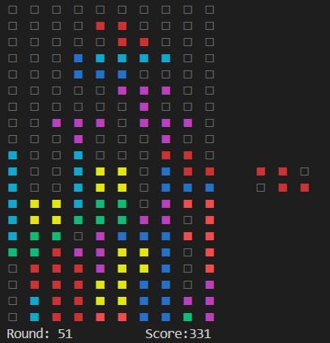

# REPLTetris.jl
This started as an exercise to learn terminal rendering and key-input.
Rendering is greatily improved through only rendering diffs to the last screen.

This is a screenshot playing in the VSCode REPL:


ToDo:
- [x] improve rendering speed
- [x] look up and comply with traditional colors
- [ ] use traditional scoring & levels
- [x] present upcoming tile to the right
- [x] look into better type-structures - `StaticArrays` aren't really needed

# Installation & Usage
The package is not yet registered in Meta-Data. You will need to clone it from this site:

```julia-REPL
Julia> Pkg.clone("https://github.com/ChristianKurz/REPLTetris.jl")
Julia> using REPLTetris
Julia> tetris()
```

Game is controlled via arrow-keys and space:
- `Up`: Rotate Clockwise
- `Left` / `Right` / `Down`: Move Current Tile
- `Space`: Drop Current Tile to Bottom
- `CTRL-C`: Abort Game
